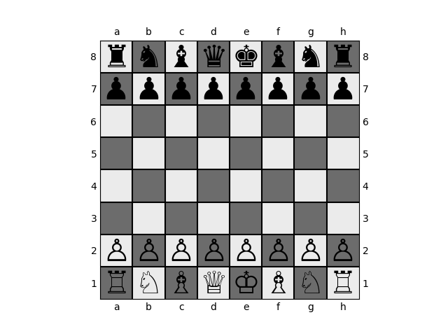
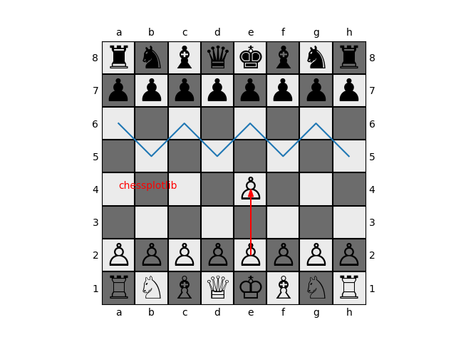

About
=====
This a python library for creating chess visualizations within matplotlib. This
is useful if you need to create custom visualizations. For example, plotting the
probability distributions over different moves for a given board. 

Usage
-----
This library is built on top of objects from `python-chess
<https://python-chess.readthedocs.io/en/latest/>`_. You can intialize a plot
with a specific board using :code:`plot_board`.

.. code-block:: python

    import chess
    from chessplotlib import plot_board, plot_move
    import matplotlib.pyplot as plt

    board = chess.Board()
    ax = plt.gca()
    plot_board(ax, board)
    plt.show()

Now, we can plot on top of this axis to add more visualizations. We can
visualize a move with :code:`plot_move`.

.. code-block:: python

    plot_move(ax, board, 'e2e4')
    plt.show()

Then, you can add whatever else you would like using matplotlib,

.. code-block:: python

    plt.plot(range(8), [2, 3, 2, 3, 2, 3, 2, 3])
    ax.text(0, 4, "chessplotlib", color='red')
    plt.show()

